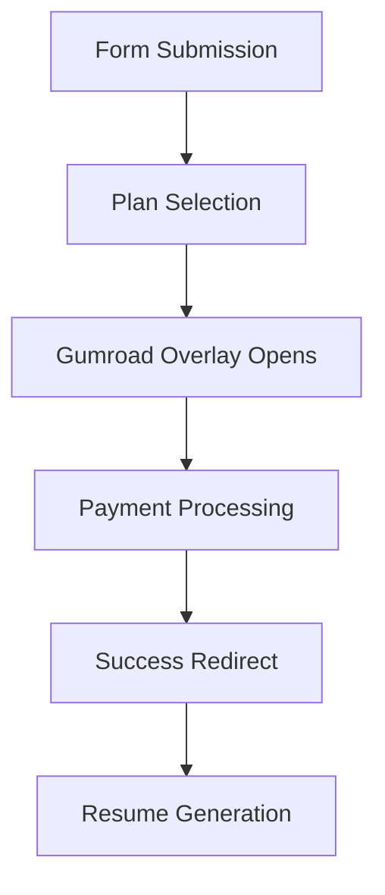

# 🛒 Gumroad Payment Integration Setup Guide

## Overview
Complete integration guide for Gumroad payment processing in the ResumeBuilder application. This setup uses Gumroad's overlay checkout system with Euro pricing and three product tiers.

## ✅ What's Already Implemented

### 🔧 Frontend Integration
- **Gumroad Overlay Checkout**: Complete client-side integration with overlay support
- **Euro Pricing**: All products configured with Euro (€) currency
- **Three Product Tiers**: Single Resume (€1), 10 Days Access (€4), Monthly Subscription (€9)
- **Success Page**: Post-purchase confirmation and next steps
- **Plan Selection**: Integration with existing form flow

### 🎯 Product Configuration
- **€1 — Single Resume**: One-time purchase for single resume generation
- **€4 — 10 Days Access**: Time-limited access with 10 days validity
- **€9 — Monthly Subscription**: Recurring monthly subscription

### 📊 Supported Features
- ✅ Gumroad overlay checkout integration
- ✅ Euro currency pricing display
- ✅ Product validation and error handling
- ✅ Success page with purchase confirmation
- ✅ Session-based purchase tracking
- ✅ Form data preservation through checkout flow

## 🛠️ Setup Instructions

### 1. Gumroad Account Setup

#### A. Create Gumroad Account
1. Go to [Gumroad.com](https://gumroad.com) and create an account
2. Complete your profile setup and tax information
3. Set your payout currency to **EUR** (Euro)
4. Verify your account for payment processing

#### B. Create Products in Gumroad Dashboard

**1. Single Resume (€1)**
```
Product Name: Single Resume
Description: One-time professional resume generation with AI optimization
Price: €1.00
Type: Digital Product
Permalink: single-resume
```

**2. 10 Days Access (€4)**
```
Product Name: 10 Days Access
Description: Unlimited resume generation for 10 days with AI-powered optimization
Price: €4.00
Type: Digital Product
Permalink: 10day-access
```

**3. Monthly Subscription (€9)**
```
Product Name: Monthly Subscription
Description: Monthly recurring access to unlimited resume generation
Price: €9.00
Type: Subscription (Monthly)
Permalink: monthly-access
```

### 2. Environment Configuration

#### Frontend Environment Variables
Create/update `frontend/.env.local`:

```bash
# Supabase Configuration
VITE_SUPABASE_URL=https://your-project.supabase.co
VITE_SUPABASE_ANON_KEY=your-anon-key-here

# Gumroad Configuration
VITE_GUMROAD_SINGLE_RESUME_URL=https://gum.co/single-resume
VITE_GUMROAD_10DAY_ACCESS_URL=https://gum.co/10day-access
VITE_GUMROAD_MONTHLY_ACCESS_URL=https://gum.co/monthly-access

# Application Configuration
VITE_APP_URL=http://localhost:8080
VITE_ENVIRONMENT=development
```

#### Backend Environment Variables (Optional)
If you plan to add webhook processing later:

```bash
# Supabase Configuration
SUPABASE_URL=https://your-project.supabase.co
SUPABASE_SERVICE_ROLE_KEY=your-service-role-key-here

# Gumroad Configuration (for future webhook integration)
GUMROAD_SINGLE_RESUME_URL=https://gum.co/single-resume
GUMROAD_10DAY_ACCESS_URL=https://gum.co/10day-access
GUMROAD_MONTHLY_ACCESS_URL=https://gum.co/monthly-access

# OpenAI Configuration
OPENAI_API_KEY=your-openai-api-key-here
```

### 3. Update Gumroad URLs

After creating products in Gumroad, update the URLs in your environment variables:

1. **Copy your actual Gumroad URLs** from the dashboard
2. **Update the environment variables** with your real URLs:
   ```bash
   VITE_GUMROAD_SINGLE_RESUME_URL=https://gum.co/your-actual-single-resume-permalink
   VITE_GUMROAD_10DAY_ACCESS_URL=https://gum.co/your-actual-10day-access-permalink
   VITE_GUMROAD_MONTHLY_ACCESS_URL=https://gum.co/your-actual-monthly-access-permalink
   ```

### 4. Gumroad Overlay Configuration

The Gumroad overlay is automatically loaded by the `GumroadService`. No additional configuration is needed, but you can customize the checkout experience:

#### A. Success URL Configuration
In each Gumroad product settings:
1. Go to **Product Settings > Advanced**
2. Set **Redirect URL**: `https://your-domain.com/gumroad/success?product={product_id}&purchase_id={purchase_id}&email={email}`

#### B. Overlay Customization
The overlay will automatically:
- Load the Gumroad script
- Open checkout in overlay mode
- Fall back to new tab if overlay fails
- Handle success/error callbacks

## 🎯 Integration Flow

### User Journey
1. **Form Submission**: User fills out resume form
2. **Plan Selection**: User selects one of three pricing tiers
3. **Gumroad Checkout**: Overlay opens with secure Gumroad payment
4. **Payment Processing**: Gumroad handles payment securely
5. **Success Redirect**: User returns to success page
6. **Resume Generation**: User can generate their resume

### Technical Flow


## 🧪 Testing Guide

### Manual Testing Checklist

#### User Flow Testing
- [ ] **Form Submission**: User fills form and reaches plan selection
- [ ] **Plan Selection**: User can select different plans (€1, €4, €9)
- [ ] **Gumroad Overlay**: Checkout overlay opens correctly
- [ ] **Payment Processing**: Test payments complete successfully
- [ ] **Success Page**: Users see confirmation after payment
- [ ] **Resume Generation**: Paid users can generate resumes

#### Pricing Display
- [ ] **Euro Currency**: All prices display in Euro (€)
- [ ] **Correct Amounts**: €1, €4, €9 displayed correctly
- [ ] **Subscription Indicator**: Monthly subscription shows "/month"
- [ ] **Access Duration**: 10 days access shows "/10 days"

#### Error Handling
- [ ] **Invalid URLs**: Proper error messages for invalid Gumroad URLs
- [ ] **Network Issues**: Graceful degradation when Gumroad is unavailable
- [ ] **Overlay Failures**: Fallback to new tab when overlay fails

### Test Payment Methods

#### Gumroad Test Mode
1. **Enable Test Mode** in your Gumroad account settings
2. **Use Test Cards**:
   - **Successful payment**: `4242 4242 4242 4242`
   - **Declined payment**: `4000 0000 0000 0002`
3. **Test Different Scenarios**:
   - Successful purchase
   - Failed payment
   - Cancelled checkout

## 🔧 Customization Options

### Product Configuration
You can easily modify the products in `frontend/src/lib/gumroad.ts`:

```typescript
export const GUMROAD_PRODUCTS: Record<string, GumroadProduct> = {
  single: {
    id: 'single_resume',
    name: 'Single Resume',
    price: 1, // Change price here
    currency: 'EUR',
    // ... other properties
  },
  // ... other products
};
```

### Styling Customization
The checkout UI uses Tailwind CSS and can be customized in:
- `frontend/src/pages/PlanSelection.tsx` - Plan selection cards
- `frontend/src/pages/GumroadSuccess.tsx` - Success page layout

### Overlay Behavior
Customize overlay behavior in `frontend/src/lib/gumroad.ts`:
- Fallback behavior when overlay fails
- Success/error callback handling
- Custom redirect URLs

## 🚀 Production Deployment

### Pre-Deployment Checklist
- [ ] **Gumroad products created** with correct pricing
- [ ] **Environment variables updated** with real Gumroad URLs
- [ ] **Success redirect URLs configured** in Gumroad dashboard
- [ ] **Test mode disabled** in Gumroad account
- [ ] **Payment flow tested** end-to-end

### Environment Variables (Production)
```bash
# Frontend (Vercel)
VITE_SUPABASE_URL=https://your-project.supabase.co
VITE_SUPABASE_ANON_KEY=your-anon-key
VITE_GUMROAD_SINGLE_RESUME_URL=https://gum.co/your-single-resume
VITE_GUMROAD_10DAY_ACCESS_URL=https://gum.co/your-10day-access
VITE_GUMROAD_MONTHLY_ACCESS_URL=https://gum.co/your-monthly-access
VITE_APP_URL=https://your-domain.com
VITE_ENVIRONMENT=production
```

### Gumroad Dashboard Configuration
1. **Set success redirect URLs** to your production domain
2. **Configure webhook URLs** (if implementing server-side validation)
3. **Enable live mode** for real payments
4. **Test with real payment methods**

## 📞 Support & Troubleshooting

### Common Issues

#### 1. Overlay Not Loading
- Check browser console for script loading errors
- Verify Gumroad script is not blocked by ad blockers
- Test fallback to new tab functionality

#### 2. Incorrect Pricing Display
- Verify Euro currency formatting
- Check product configuration in `gumroad.ts`
- Ensure environment variables are set correctly

#### 3. Success Page Not Loading
- Check redirect URL configuration in Gumroad
- Verify route is properly configured in `App.tsx`
- Test with different browsers

#### 4. Payment Not Processing
- Verify Gumroad URLs are correct and accessible
- Check Gumroad account is in live mode for production
- Test with different payment methods

### Debug Commands

#### Check Environment Variables
```bash
# In browser console
console.log(import.meta.env.VITE_GUMROAD_SINGLE_RESUME_URL);
```

#### Test Product Configuration
```bash
# In browser console
import { gumroad } from './src/lib/gumroad';
console.log(gumroad.getProducts());
```

### Gumroad Resources
- [Gumroad Documentation](https://help.gumroad.com/)
- [Gumroad Overlay Documentation](https://help.gumroad.com/article/106-using-the-gumroad-overlay)
- [Gumroad API Reference](https://help.gumroad.com/article/280-gumroad-api)

## 🎉 Launch Checklist

Before going live:

- [ ] All Gumroad products created with correct Euro pricing
- [ ] Environment variables configured for production
- [ ] Success redirect URLs updated to production domain
- [ ] Payment flow tested end-to-end in production environment
- [ ] Gumroad account verified and in live mode
- [ ] Customer support process defined for billing issues
- [ ] Analytics and tracking configured (optional)
- [ ] Error monitoring set up for payment failures

---

## 🎊 **Your Gumroad Integration is Complete!**

### What You Have Now:
- ✅ **Three pricing tiers** with Euro currency
- ✅ **Secure Gumroad checkout** with overlay support
- ✅ **Professional UI** with proper error handling
- ✅ **Success flow** with resume generation
- ✅ **Session-based tracking** for purchase status

### Next Steps:
1. Create your products in Gumroad dashboard
2. Update environment variables with real URLs
3. Test the complete payment flow
4. Deploy to production
5. Launch your resume builder! 🚀

**Your users can now purchase resume generation services with a smooth, secure Gumroad checkout experience!**
